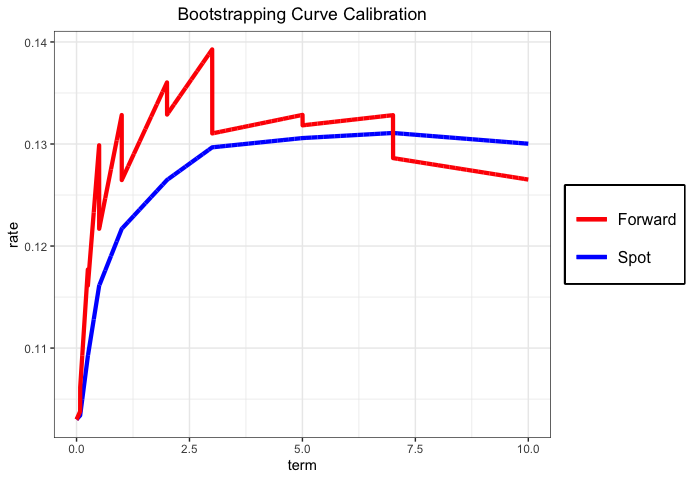

<!-- README.md is generated from README.Rmd. Please edit that file -->

# QuantBondCurves

<!-- badges: start -->
<!-- badges: end -->

The ‘QuantBondCurves’ package offers a range of functions for valuing
various asset types and calibrating discount curves. It covers
fixed-coupon assets, floating note assets and swaps, with varying
payment frequencies. The package also enables the calibration of spot,
instantaneous forward and basis curves, making it a powerful tool for
accurate and flexible bond valuation and curve generation. The valuation
and calibration techniques presented here are consistent with industry
standards and incorporates author’s own calculations.

In light of the ongoing transition in the financial industry away from
LIBOR, the inclusion of LIBOR in the package is intended to provide
comprehensive coverage and enhance user convenience.

## Installation

You can install `QuantBondCurves` from the CRAN repository with:

``` r
install.packages("QuantBondCurves")
```

## Examples

The ‘QuantBondCurves’ package offers the possibility of valuing various
asset types. Below is a typical example for a bond indexed to 3M IBR
rate.

``` r
# Calculates bond value
valuation.bonds(maturity = "2026-06-01", coupon.rate = 0.06, rates = 0.08, principal = 1000,
                analysis.date = "2025-06-01", asset.type = "IBR", freq = 4, rate.type = 1, 
                daycount = "ACT/365")
#> [1] 983.1184
```

The process of valuing a bond can be broken down into multiple
functions. In the following example, the various functions that comprise
`valuation.bonds` are presented.

``` r
# Calculates coupon dates
coupon.dates(maturity = "2026-06-01", analysis.date = "2025-06-01",
             asset.type = "IBR")
#> $dates
#> [1] "2025-09-01" "2025-12-01" "2026-03-01" "2026-06-01"
#> 
#> $effective.dates
#> [1] "2025-09-01" "2025-12-01" "2026-03-02" "2026-06-01"

# Calculates coupons
coupons(maturity = "2026-06-01" , analysis.date = "2025-06-01",
        coupon.rate = 0.06, principal = 1000, asset.type = "IBR")
#> [1]   15.33333   15.16667   15.00000 1015.33333

# Calculate discount factors
discount.factors(dates = c("2025-09-01", "2025-12-01", "2026-03-01", "2026-06-01"),
                 rates = c(0.01, 0.015, 0.017, 0.02), analysis.date = "2025-06-01",
                 rate.type = 1, freq = 4)
#> [1] 0.9974858 0.9925216 0.9873920 0.9802475
```

In addition to bond valuation, there are several other typical measures
that can be calculated, such as the asset’s internal rate of return
(IRR), accrued interest, bond sensitivity, or weighted average life. To
illustrate these calculations, an example for each one is presented
below:

``` r
# Calculates accrued interests
accrued.interests(maturity = '2026-06-01', analysis.date = "2025-06-01", 
                  coupon.rate = 0.06, asset.type= 'IBR', daycount = "ACT/365")
#> [1] 0

# Calculate IRR of asset
bond.price2rate(maturity = "2026-06-01", price = 983.1184, analysis.date = "2025-06-01", 
                coupon.rate = 0.06, principal = 1000, asset.type = "IBR", freq = 4, 
                daycount = "ACT/365")
#> [1] 0.08000003

# Calculates bond sensitivity
sens.bonds(input = "price", price = 983.1184, maturity = "2026-06-01",
           analysis.date = "2025-06-01", coupon.rate = 0.06,
           principal = 1000, asset.type = "IBR", freq = 4, 
           dirty = 1)
#> [1] 0.9055163

# Calculates weighted average life
average.life(input = c("rate"), price = 0.08, maturity = "2026-06-01", 
             analysis.date = "2025-06-01", coupon.rate = 0.06,
             principal = 1000, asset.type = "IBR", freq = 4)
#> [1] 0.9778354
```

Lastly, with respect to valuation, the `valuation.swaps` function
enables the process of valuing Interest Rate Swaps and Cross Currency
Swaps. A straightforward example is offered for the former, as the
latter may require basis curve calibration which can be accomplished
using the calibration functions provided in the package.

``` r
# Calculates swap value
valuation.swaps(maturity = "2026-06-01", analysis.date = "2025-06-01",    
                coupon.rate = 0.02, rates = c(0.03,0.04,0.05,0.06),
                float.rate = 0.03, principal = 1000)
#> [1] 37.28375
```

Another key feature of the package is curve calibration. These functions
provide the capability to calibrate spot, forward, and basis curves in a
flexible manner, allowing the user to choose over several methods for
calibrating each curve. The package also allows for the transformation
of spot to forward curves and vice versa. To demonstrate this feature, a
simple example that outlines the process of spot calibration using the
bootstrapping method is provided. Afterwards, output is transformed into
a forward curve:

``` r
# Calibrates spot curve
yield.curve <- c(0.103,0.1034,0.1092, 0.1161, 0.1233, 0.1280, 0.1310, 0.1320,                   0.1325, 0.1320)
names(yield.curve) <- c(0,0.08,0.25,0.5,1,2,3,5,7,10)
nodes <- seq(0,10,0.001)

spot <- curve.calibration (yield.curve = yield.curve, market.assets = NULL,
                           analysis.date = "2019-01-03", asset.type = "IBRSwaps",
                           freq = 4, daycount = "ACT/365", fwd = 0, nodes = nodes,
                           approximation = "linear")

# Spot to forward
dates   <- names(spot)
forward <- spot2forward(dates, spot, approximation = "linear")
```

Below, the calibrated spot curve and its instantaneous forward
equivalent are plotted:


